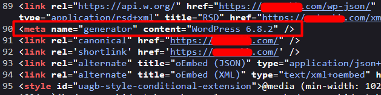
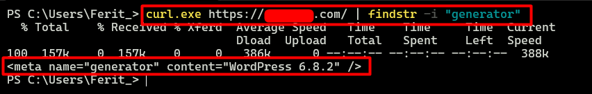
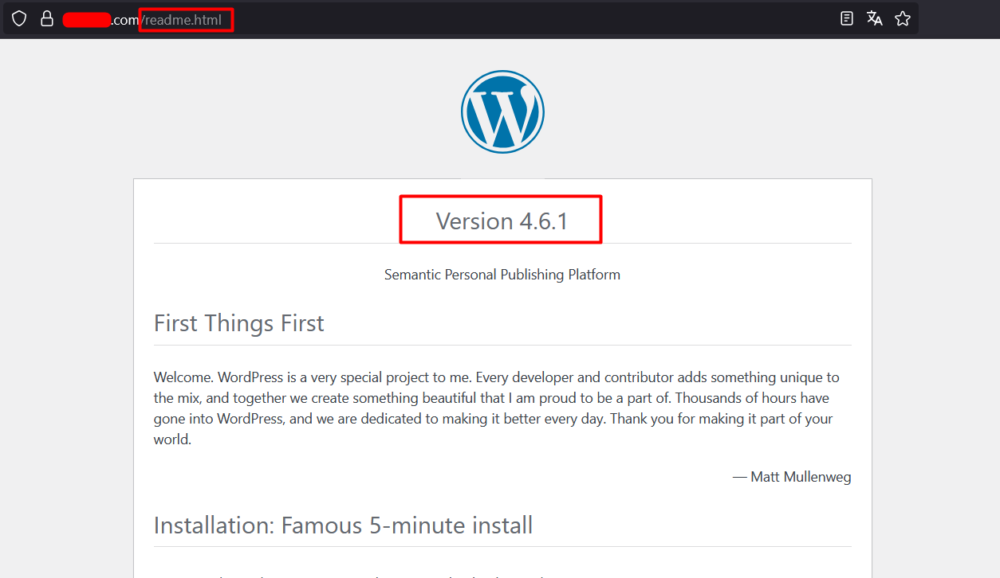
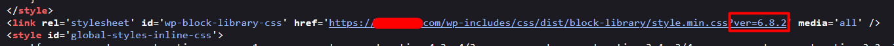

# Version Enumeration

### Meta Generator Tag
- Check the version at "<meta name="generator" content="WordPress version">" tag in HTML source of the page.



- Check the WordPress version by using curl

Linux:

```
curl -I http://example.com | grep -i "X-Powered-By"
```
```
curl.exe -I https://example.com/ | findstr -i "generator"
```

Windows:

```
curl.exe -I https://example.com/ | findstr -i "X-Powered-By"
```

```
curl.exe -I https://example.com/ | findstr -i "generator"
```

Example:




### Readme.html
- If the "meta" tag and the "X-Powered-By" disabled, check for the "/readme.html" for wordpress version. (Note: This trick only valid on older versions of wordpress)




### Javascript, CSS Resources
- The version might be appear on javascript and css resources as a parameter.



------------
# Why is Important Wordpress Version
- Certain WordPress versions are known to have vulnerabilities that can be directly exploited; therefore, accurately detecting the version is essential.
- Exploitation with core version is explained on another title in this repo.

### Mitigation
- A good mitigation for WordPress version enumeration is to limit or hide version information that can be disclosed through HTML meta tags, HTTP headers, or default files. This can be done by removing the <meta name="generator"> tag, disabling or restricting the X-Powered-By header at the web server level, and deleting or blocking public access to files such as readme.html that reveal version numbers. In addition, WordPress administrators should regularly update both the core and plugins to the latest versions, because even if the version cannot be easily enumerated, outdated code remains vulnerable.