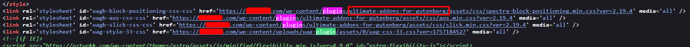
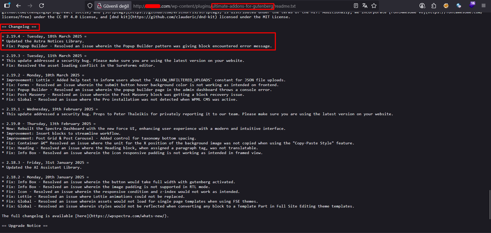

# Plugin Enumeration
A WordPress plugin is a software module that extends the core functionality of WordPress without modifying its source code. It allows users to add features such as SEO tools, security enhancements, e-commerce capabilities, or custom forms.

- During WordPress plugin enumeration, for example, you might view the page source of a WordPress site and notice a reference to /wp-content/plugins/contact-form-7/. This indicates that the Contact Form 7 plugin is installed, even without sending any special requests.

- If no plugins are visible in the source, you could switch to active enumeration. For instance, by testing known plugin paths like /wp-content/plugins/akismet/ or /wp-content/plugins/woocommerce/, the server response codes (e.g., 403 Forbidden for existing directories versus 404 Not Found for non-existing ones) can reveal which plugins are installed. 

- Once you have a list of plugins that are present on the site, can be used to determine the version of the plugin: 

```
curl https://myvulnerablesite.com/wp-content/plugins/plugin_name/readme.txt
```

Example:






### Mitigation
- To reduce the risk of plugin enumeration, administrators should disable directory listing on the web server and restrict direct access to sensitive files like readme.txt or changelog.txt within plugin directories. Regularly updating all plugins to their latest versions ensures that even if attackers identify them, the risk of exploiting known vulnerabilities is minimized.