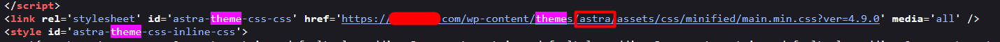
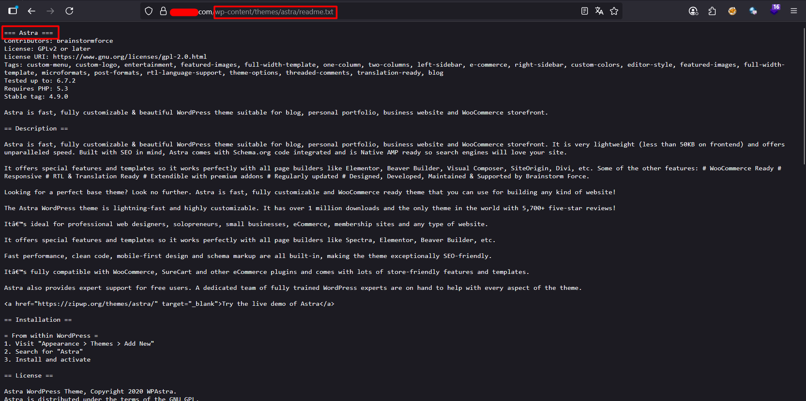

# Theme Enumeration

Themes can have vulnerabilities:

- Just like plugins, WordPress themes may contain security flaws.

- Themes consist of PHP code along with HTML and CSS resources.

- More complex themes usually include more components, which increases the likelihood of vulnerabilities.

Finding the theme:

- Theme paths are often visible in the HTML source of the site.

For example, a CSS file may reveal the theme path:

```
<link rel="stylesheet" href="http://examplewp.com/wp-content/themes/Avada/style.css" />
```

With the path we have the theme name, and we can load the readme.txt to confirm the theme in use and the version:

```
curl http://examplewp.com/wp-content/themes/theme_name/readme.txt
```

Example:





### Mitigation
- To protect against theme enumeration, administrators should disable directory listing on the server and restrict access to sensitive files such as readme.txt or changelog.txt within theme directories. Regularly updating all themes to their latest versions ensures that even if a theme is identified, any known vulnerabilities are patched. Additionally, removing unused or inactive themes reduces the attack surface