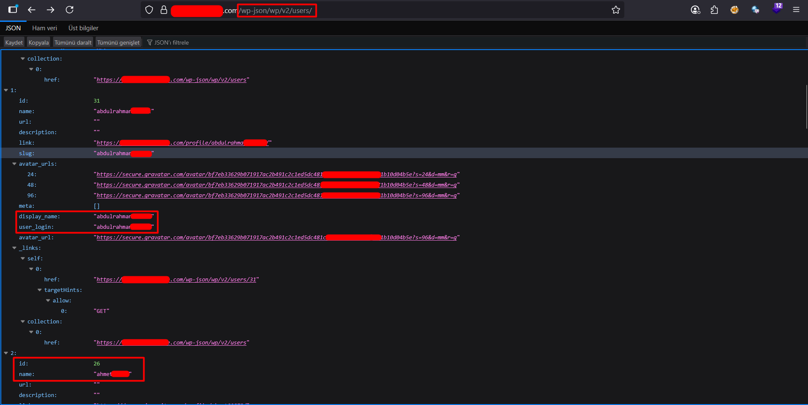

# User Enumeration

If valid usernames can be gathered from a WordPress site, password guessing or brute force attacks can then be attempted on those accounts. If an administrator account is compromised, full control of the site is possible, including access to the database and, in many cases, execution of PHP code on the server. 


### Author Archives
- In a default installation you should be able to find the users of a site by iterating through the user id's and appending them to the sites URL. For example /?author=1, adding 2 then 3 etc to the URL will reveal the users login id either through a 301 redirect with a Location HTTP Header.

```
curl http://example.com/?author=1
```

- If the .htaccess blocks "?author" use these bypasses:

```
# Bypass 1 : http://example.com/?x&author=1 --> http://example.com/author/admin/?x
# Bypass 2 : http://example.com/index.php?author=1
```


#### Users listed in JSON API Endpoint
- Using a json endpoint it may be possible to get a list of users on the site. This was restricted in version 4.7.1 to only show a user if configured, before that all users who had published a post were shown by default.

```
curl http://example.com/wp-json/wp/v2/users
```

```
curl http://example.com/wp-json/wp/v2/users/1
```

### Another Way

```
curl https://example.com/wp-json/?rest_route=/wp/v2/users
```

Example:


