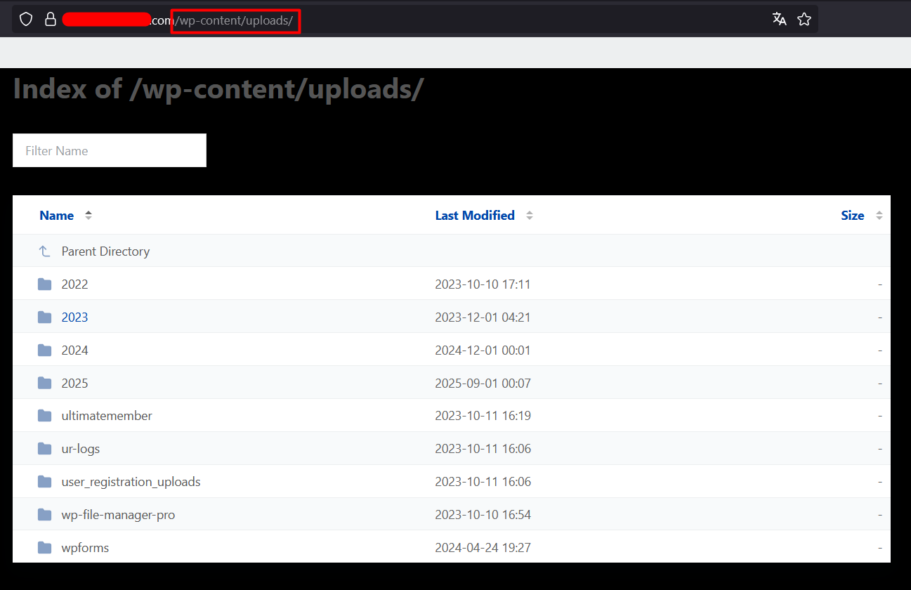

# Directory Indexing

Directory indexing is a function of the web server that allows you to view the contents of a directory in the web accessible path.

Viewing the contents of a directory allows an attacker to gather a lot of information about the installation such as installed plugins and themes without the need to brute force the paths.

To check for directory indexing you can browse to folder locations and see if you get a response that includes "Index Of" and a list of folders / files. Common locations to check would be:

```
/wp-content/
/wp-content/uploads/
/wp-content/plugins/
/wp-content/themes/
/uploads/
/images/
/wp-includes/
```

Other Interesting Files:
```
/robots.txt
/feed
/readme.html
/xmlrpc.php
/.htaccess
/wp-config.php
/_wpeprivate/config.json
```

If you can browse /wp-content/plugins/ - the enumeration of plugins and versions becomes much easier.

If you can not browse these endpoints, just right click any photo on the site and click "Open in new tab". If the indexing avaible you can find the real endpoint.

Example:




### Mitigation
- To prevent directory indexing, web administrators should disable the feature at the server level (Apache: Options -Indexes; Nginx: autoindex off;) to ensure that the contents of directories are not publicly listed. Access to sensitive directories such as /wp-content/, /wp-includes/, and /wp-admin/ should be restricted or protected using proper permissions. Additionally, sensitive files like readme.html, wp-config.php, and configuration JSON files should be removed from public access or blocked via .htaccess or server rules. Regularly auditing directory permissions and using security plugins or a Web Application Firewall (WAF) can further help block automated scans and prevent attackers from enumerating installed themes, plugins, or other site information.