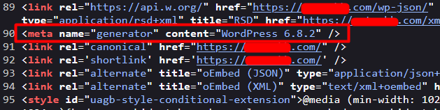
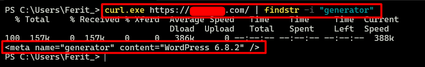
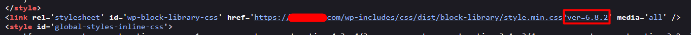

# Version Enumeration

### Meta Generator Tag
- Check the version at "<meta name="generator" content="WordPress version">" tag in HTML source of the page.



- Check the WordPress version by using curl

Linux:

```
curl -I http://example.com | grep -i "X-Powered-By"
```
```
curl.exe -I https://example.com/ | findstr -i "generator"
```

Windows:

```
curl.exe -I https://example.com/ | findstr -i "X-Powered-By"
```

```
curl.exe -I https://example.com/ | findstr -i "generator"
```

Example:




### Readme.html
If the "meta" tag and the "X-Powered-By" disabled, check for the "/readme.html" for wordpress version.


### Javascript, CSS Resources
The version might be appear on javascript and css resources as a parameter.



------------
# Why is Important Wordpress Version
- Certain WordPress versions are known to have vulnerabilities that can be directly exploited; therefore, accurately detecting the version is essential.